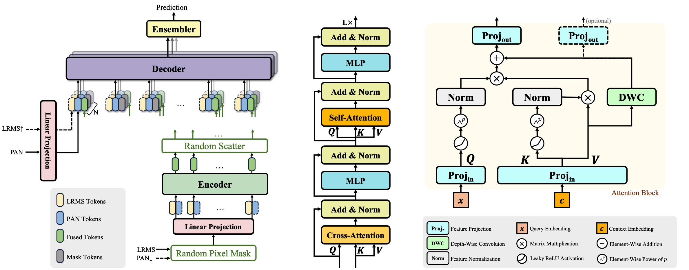

# TGRS'24 PEMAE: Pixel-Wise Ensembled Masked Autoencoder for Multispectral Pan-Sharpening

This is the official pytorch implementation of [Pixel-Wise Ensembled Masked Autoencoder for Multispectral Pan-Sharpening](https://ieeexplore.ieee.org/document/10649657) (PEMAE) (TGRS 2024)


<hr />

> **Abstract:** *Pan-sharpening requires the fusion of a low-spatial resolution multispectral image (LRMS) and a panchromatic image (PAN) with rich spatial details to obtain a high-spatial resolution multispectral image (HRMS). Recently, deep learning (DL) based models have been proposed to tackle this problem and have made considerable progress. However, most existing methods rely on the conventional observation model, which treats LRMS as a blurred and downsampled version of HRMS. This observation model may lead to unsatisfactory performance and limited generalization ability at full-resolution evaluation, resulting in severe spectral and spatial distortion, as we observed that while DL-based models show significant improvement over traditional models on reduced-resolution evaluation, their performances deteriorate significantly at full-resolution. In this paper, we rethink the observation model and present a novel perspective from HRMS to LRMS, and propose a pixel-wise ensembled masked autoencoder (PEMAE) to restore HRMS. Specifically, we consider LRMS as the result of pixel-wise masking on HRMS. Thus LRMS can be seen as a natural input of a masked autoencoder. By ensembling the reconstruction results of multiple masking patterns, PEMAE obtains HRMS with both spectral information of LRMS and spatial details of PAN. In addition, we employ a linear cross-attention mechanism to replace the regular self-attention to reduce the computation to linear time complexity. Extensive experiments demonstrate that PEMAE outperforms state-of-the-art methods in terms of quantitative and visual performance at both reduced- and full-resolution evaluation. Codes are available at https://github.com/yc-cui/PEMAE.* 
<hr />


## Network Architecture



## Prerequisites

Install `pytorch`, `torchvision`, `pytorch-lightning`, `torchmetrics`, `mmcv`, `timm` and other necessary packages. Please install the latest version of `torchmetrics`, as the early version may have bugs to calculate ERGAS. 

## Datasets

Download the public dataset [NBU_PansharpRSData](https://github.com/starboot/NBU_PansharpRSData) and unzip it to somewhere.

Modify the `sensor2dir` in [train.py](./train.py), point it to your unzipped data.

## Training and testing

Refer to the given args in [train.py](./train.py) to run the training and testing script.

For example, PEMAE with 8 layers, 32 embedding dimension, and 4 ensemblings, using downsampled pan and upsampled ms as auxiliary inputs:

```bash
python train.py --scatter_num 4 --depth 8 --dim 32 --pan_down --lrms_up
```

The training and testing results will be saved at log*.

## Citation

If you use PEMAE in your research, please use the following BibTeX entry.
```
@ARTICLE{10649657,
  author={Cui, Yongchuan and Liu, Peng and Ma, Yan and Chen, Lajiao and Xu, Mengzhen and Guo, Xingyan},
  journal={IEEE Transactions on Geoscience and Remote Sensing}, 
  title={Pixel-Wise Ensembled Masked Autoencoder for Multispectral Pan-Sharpening}, 
  year={2024},
  volume={},
  number={},
  pages={1-1},
  keywords={Training;Deep learning;Image reconstruction;Transformers;Satellites;Measurement;Feature extraction;Multispectral pan-sharpening;image fusion;masked autoencoder;deep learning},
  doi={10.1109/TGRS.2024.3450688}}
```

## Contact

Should you have any question, please contact cugcuiyc@cug.edu.cn